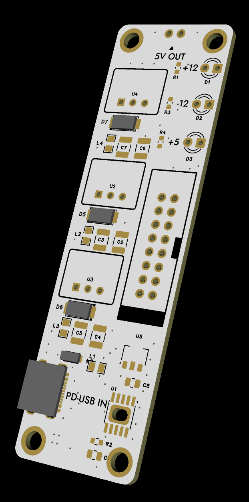
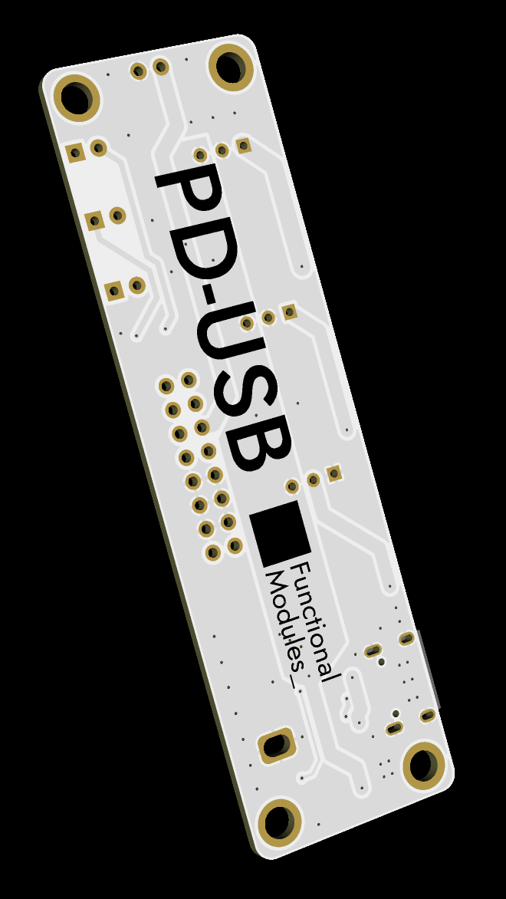

# Eurorack PD USB Power Supply

**2025-04-10 test result: Noise performance is poor. The noise appears to be caused by the non-linear behavior of the PTC, and a redesign is planned.**

USB-C PD powered Eurorack supply module inspired by "Powerline", with +12 V, -12 V, and +5 V rails, and extra short-circuit protection, reverse-voltage protection.

Check the original Powerline design at:

**https://github.com/Andreas-Dorfner/Powerline-USB-C**

## Hardware Preview

| Front | Back |
| --- | --- |
|  |  |

## Overview

This module is designed to power a Eurorack system from a USB-C Power Delivery source. It negotiates a **20 V PD 3.0 input profile** and generates the three standard Eurorack rails.

## Electrical Specifications

| Item | Specification |
| --- | --- |
| Input connector | USB-C |
| Input standard | USB Power Delivery 3.0 |
| Required PD profile | 20 V |
| Output rails | +12 V, -12 V, +5 V |
| Estimated output current | +12 V / 1.5 A, -12 V / 1.5 A, +5 V / 1.5 A |

## Disclaimer

This project has **not yet been validated on hardware** and should be considered **untested** at this stage. 

Build, test, and use it at your own risk, and always validate the supply before connecting modules.

## License

This project is licensed under the [MIT License](LICENSE).
