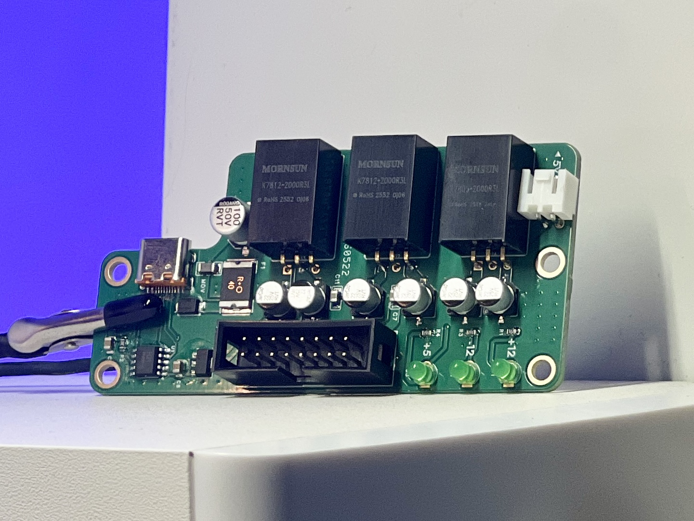
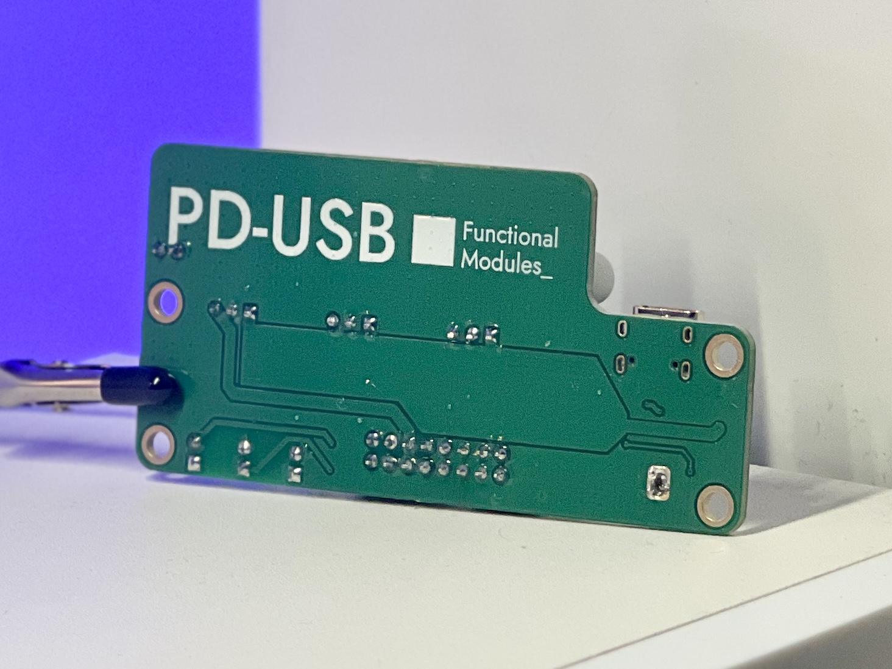
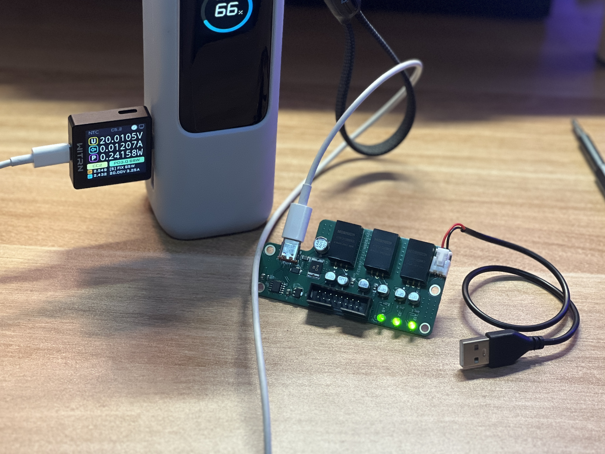

# Eurorack PD USB 电源模块

这是一个由 USB-C PD 供电的 Eurorack 电源模块，灵感来自 “Powerline”。它提供 **+12V、-12V、+5V** 三路电源轨，并额外加入了短路保护和反向电压保护。

原版 Powerline 设计见：

**https://github.com/Andreas-Dorfner/Powerline-USB-C**

## 硬件预览

| 正面 | 背面 |
| --- | --- |
|  |  |

## 概述

该模块用于通过 USB-C Power Delivery 电源为 Eurorack 系统供电，握手 **PD 3.0 20V 输入档位**，并转换出 Eurorack 常用的三路标准电源轨。

## 电气规格

| 项目 | 参数 |
| --- | --- |
| 输入接口 | USB-C |
| 输入协议 | USB Power Delivery 3.0 |
| 输入电压档位 | 20V |
| 输出电源轨 | +12V, -12V, +5V |
| 估计输出电流 | +12V / 1.5A, -12V / 1A, +5V / 800mA |

## 免责声明

请自行承担制作、测试和使用风险，并在连接任何 Eurorack 模块前先完成充分验证。

## 许可证

本项目采用 [MIT License](LICENSE) 开源协议。
